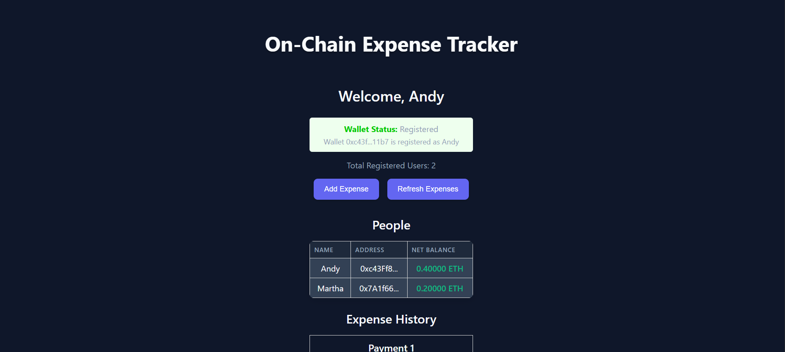
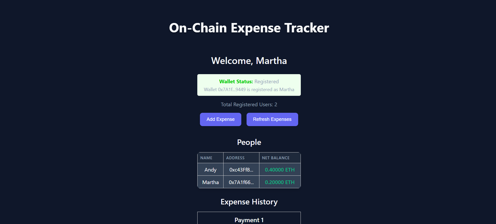
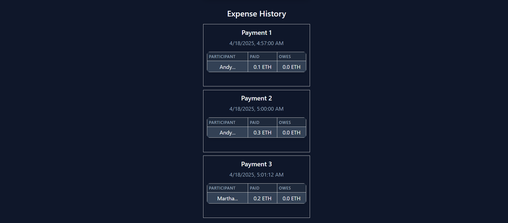

# 💸 SpendLedger – User-Friendly Decentralized Expense Tracker

> A simple and intuitive dApp built on the Ethereum **Sepolia Testnet** using **Solidity**, **React**, and **ethers.js**.  
> Users can register, track expenses, and view registered users — all securely stored on-chain.

## ✅ Additional Features Implemented

### 🛠️ Solidity Features

1. **Check if a user is registered**  
   ➤ Added `isRegistered` function to BlockBase.sol that takes address of the user as input and returns the boolean value `true` if the user is registered, `false` otherwise.

2. **Get total number of registered users**  
   ➤ Added `getTotalRegisteredPeople` function to BlockBase.sol that returns the total number of registered users on the platform.

### 💻 JavaScript Features

1. **Display connected wallet address**  
   - Added `checkWalletRegistration` function in `App.js` that checks the registration status of the connected wallet using the smart contract’s `isRegistered` function.  
   - UI: A color-coded status box displays the wallet’s registration status.

2. **Display total registered users**  
   - Introduced a state variable `totalRegisteredUsers` in `App.js` to store user count.  
   - Added `loadTotalRegisteredUsers` function to fetch data using the contract’s `getTotalRegisteredPeople` method.  
   - Triggered via `useEffect` when the contract is ready or people list updates.
   - Added code to refresh the total count after registration and after adding expenses.
   - Added UI elements to display the count in all the necessary places.

## 🧪 Screenshots

| Andy's UI | Martha's UI | Expense History |
|-----------|--------------|-----------------|
|  |  |  |

## 🪙 Smart Contract Info

- **Network**: Ethereum Sepolia Testnet  
- **Contract Address**: `0xd8e8f46b5804f570b2fae97d5316eae29d9611f1`  
- **ABI File**: Located at `/src/ExpenseTrackerABI.json`

## 📂 Project Structure

- `App.js` – React frontend logic  
- `ExpenseTracker.sol` – Solidity smart contract  
- `ExpenseTrackerABI.json` – Contract ABI  
- `assets/` – Contains demo screenshots for submission

## 👨‍💻 Author

**[I. Anders Arnold](https://github.com/asquare004)**

